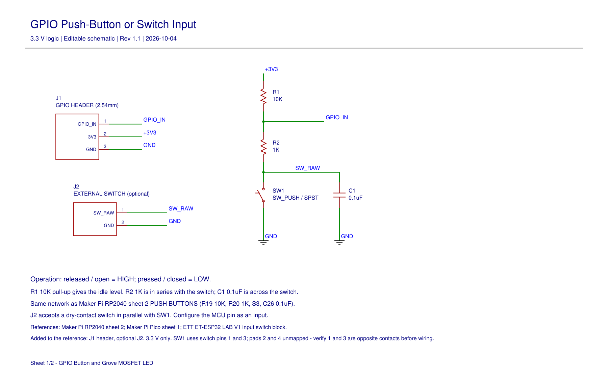
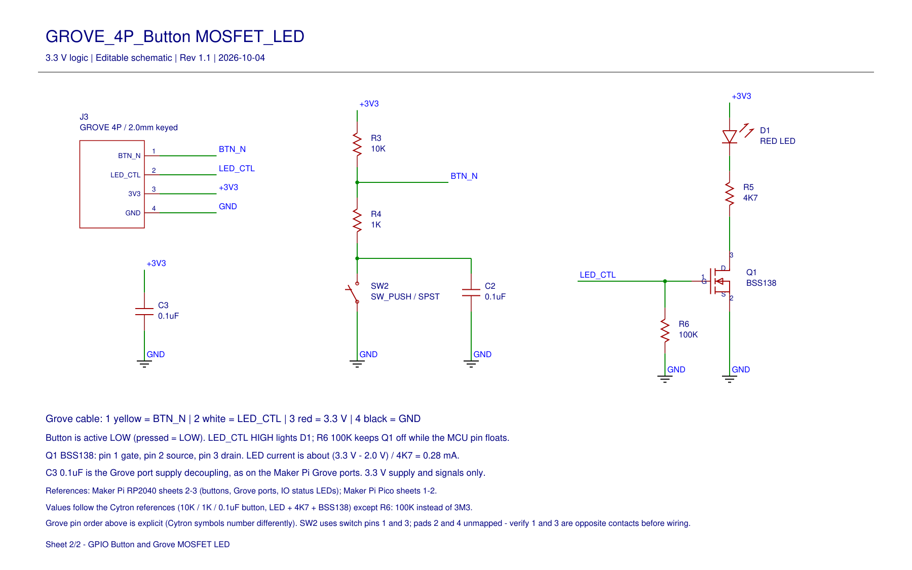

# GPIO Button and Grove MOSFET LED

Two small 3.3 V circuits drawn in EasyEDA Pro, following the Cytron Maker Pi reference schematics as closely as possible.

| Sheet | Circuit |
|---|---|
| 1 | GPIO Push-Button or Switch Input |
| 2 | GROVE_4P_Button MOSFET_LED |

**Status:** schematic only. Connections are verified by netlist; nothing has been built or hardware-tested.

## 1. GPIO Push-Button or Switch Input

`+3V3 - R1 10K - GPIO_IN - R2 1K - (SW1 || C1 0.1uF) - GND`

- Released = HIGH, pressed = LOW (about 0.30 V, because R2 is in series with the switch).
- Same network as the Maker Pi RP2040 push buttons (R19 10K, R20 1K, S3, C26 0.1uF).
- Added to the reference: J1 3-pin header (`GPIO_IN`, 3V3, GND) and J2, an optional external switch in parallel with SW1.
- RC time constants are about 1.1 ms on release and 0.1 ms on press. Use 10-20 ms firmware debounce as well.

## 2. GROVE_4P_Button MOSFET_LED

- Button: the same network as sheet 1, on `BTN_N`.
- LED: `+3V3 - D1 - R5 4K7 - Q1 BSS138 drain`, source to GND, gate driven directly by `LED_CTL`, R6 100K gate pull-down.
- C3 0.1uF decouples the Grove supply pin.
- LED current is about (3.3 V - 2.0 V) / 4K7 = 0.28 mA: a faint status indicator, as on the Maker Pi boards.

Grove connector J3:

| Pin | Cable colour | Signal |
|---|---|---|
| 1 | yellow | `BTN_N` (to MCU input, active LOW) |
| 2 | white | `LED_CTL` (from MCU output, HIGH = LED on) |
| 3 | red | 3.3 V |
| 4 | black | GND |

This is a 3.3 V design. Do not plug it into a Grove port that supplies 5 V.

## Difference from the references

Everything follows the Cytron values and topology except one part: the gate pull-down R6 is 100K instead of 3M3. `LED_CTL` arrives over a cable that can be unplugged or left floating, and 100K holds the MOSFET off more firmly.

## Before wiring a real switch

The switch symbols use pins 1 and 3 of a 4-pin 6x6 mm tactile switch. Pins 1-2 are one joined pair and 3-4 the other; footprint pads 2 and 4 are intentionally unmapped. Check with a multimeter that pins 1 and 3 are opposite contacts on the actual part.

## Files

| File | What it is |
|---|---|
| `outputs/GPIO_Button_Grove_MOSFET_LED.epro` | Native EasyEDA Pro project, including the assigned footprints. Open with File > Open Project, or import it. |
| `outputs/GPIO_Button_Grove_MOSFET_LED_Schematic.pdf` | Both sheets as exported from EasyEDA Pro. |
| `outputs/GPIO_Button_Grove_MOSFET_LED_R1_1.zip` / `.json` | Generated EasyEDA source (wiring, values and notes only). Import with Quick Start > Import Standard. |
| `outputs/*.png`, `outputs/*.svg` | Previews rendered from the source. |
| `outputs/Netlist_EasyEDA_Pro_2026-10-05.tel` | Netlist exported from the EasyEDA Pro project. |
| `outputs/Connectivity_Check.txt` | Pin-by-pin check of the source against the intended nets. |
| `outputs/Footprints.txt` | Footprints assigned in EasyEDA Pro and their pin mapping. |
| `build_circuits.py` | Generates the EasyEDA source. |
| `verify_circuits.py` | Checks every component pin against the intended nets. |
| `render_source.py` | Renders the previews (needs `pymupdf`). |

The `.epro` file is the complete design. The generated source carries the wiring, values and notes only: the footprints for Q1, the switches and the connectors were assigned in EasyEDA Pro, so re-importing the generated source does not bring them back.

## What has been checked

- Every component pin is on the intended net, in the source and in the netlist exported from EasyEDA Pro.
- EasyEDA Pro design check: 0 fatal, 0 errors, 0 warnings, 1 info (switch pads 2 and 4 have no pin, as intended).

Not checked: footprints against manufacturer drawings, physical connector orientation, LED brightness, switch bounce on real hardware.

## References

See [Design References](../../Design%20References/).
